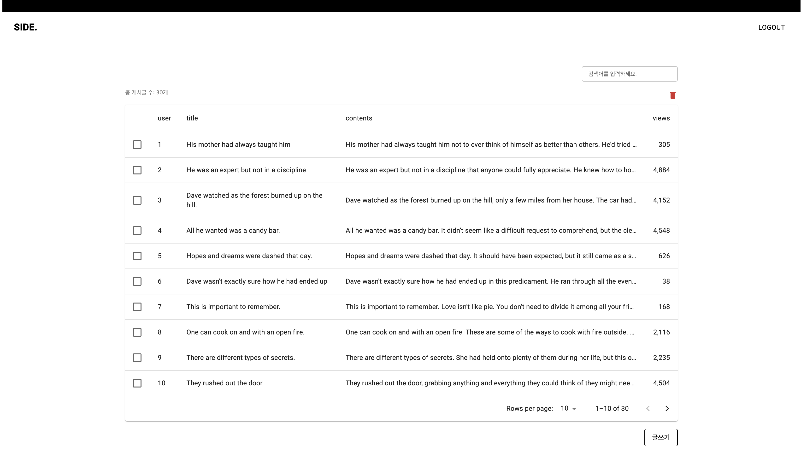

# 게시판 웹 애플리케이션

Firebase 인증 + Redux 게시판 프로젝트

## 기술 스택

- React
- TypeScript
- Redux Toolkit
- Firebase
- Material UI
- React Router

## 주요 기능

- 회원가입, 로그인, 로그아웃
- 사용자 역할(role): 관리자 / 일반 사용자 / 게스트
- 게시글 목록 조회 (dummyjson API)
- 게시글 작성 / 삭제
- 관리자 전용 삭제 기능
- 게시글 검색, 페이지네이션

## 폴더 구조
```txt
src/
├── Components/
│   ├── Board.tsx             # 게시글 목록 테이블
│   ├── LoginModal.tsx        # 로그인 모달
│   ├── Pagination.tsx        # 페이지네이션
│   ├── Search.tsx            # 게시글 검색
│   ├── SideToolbar.tsx       # 관리자용 삭제 버튼 및 게시글 수
│   ├── SignupModal.tsx       # 회원가입 모달
│   ├── TopToolbar.tsx        # 상단 도구바
│   └── Common/               # 공통 UI 요소들
│       ├── Loading.tsx       # 로딩 스피너
│
├── Contexts/
│   ├── authModalContext.tsx  # 로그인/회원가입 모달 상태
│   └── authUserContext.tsx   # 로그인 사용자 정보 전역 관리
│
├── Routes/
│   ├── Boardetail.tsx        # 게시글 상세 페이지
│   ├── Home.tsx              # 게시글 리스트 페이지
│   └── WritePost.tsx         # 게시글 작성 페이지
│
├── store/
│   ├── index.ts              # Redux 스토어 설정
│   └── posts.ts              # 게시글 상태 (Slice)
│
├── types/
│   └── board.ts              # 게시글 및 컬럼 타입 정의
│
├── App.tsx                   # 라우팅 및 전역 렌더링
└── main.tsx                  # 앱 진입점
```

## 실행 방법

npm install<br> 
npm run dev

